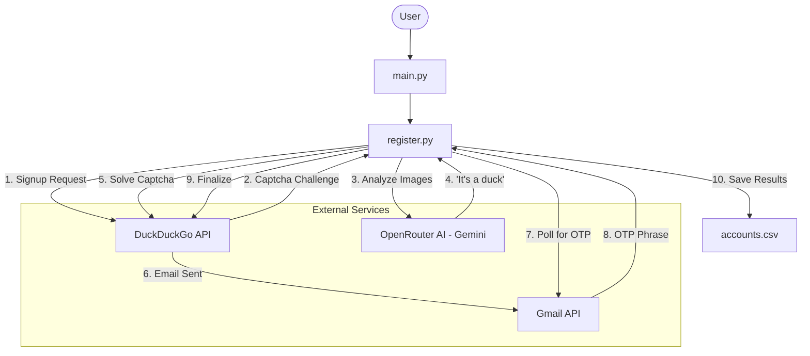

# DuckLink: Advanced Duck.com Autoreger

[](https://www.python.org/)
[](https://opensource.org/licenses/MIT)
[](https://github.com/lordradez23/DuckLink-Advanced-Duck.com-Autoreger)

DuckLink is a high-performance, asynchronous automation tool designed for bulk registration of duck.com email addresses. By combining advanced stealth techniques, AI-driven CAPTCHA solving, and human-behavior simulation, DuckLink provides a robust solution for large-scale email account creation.

---

## Key Features

- **Asynchronous Architecture**: Built on asyncio and aiohttp for maximum throughput and concurrent registration.
- **AI Captcha Solver**: Integrated with OpenRouter (Gemini 1.5 Flash) to solve visual "Is this a duck?" challenges in real-time.
- **Stealth & Fingerprinting**:
    - Randomized User-Agent generation (Windows, Android, iOS, Linux).
    - **Pixel Tracking Simulation**: Sends organic navigation signals to mimic real user behavior.
    - **Proxy Support**: Full support for HTTP/SOCKS proxies with authentication.
- **Verification Automation**: Automated OTP retrieval via Gmail API with support for sub-addressing and email variations.
- **Multiple Generation Strategies**:
    - **Domain Mode**: Fresh account creation on your target domain.
    - **Dots Mode**: Exploits Gmail-style "dot" variations.
    - **Tags Mode**: Uses sub-addressing (Note: current DDG policy limitations apply).

---

## Requirements

Before you begin, ensure you have the following:

- **Python 3.10+**
- **OpenRouter API Key**: For AI-powered CAPTCHA solving.
- **Gmail Account**: Configured for app access with client_secret.json and gmail_token.json.
- **Proxies**: High-quality residential proxies are recommended.
- **Wordlists**: For generating realistic nicknames (located in data/wordlist).

---

## Installation

1. **Clone the project:**
   ```bash
   git clone https://github.com/lordradez23/DuckLink-Advanced-Duck.com-Autoreger.git
   cd DuckLink-Advanced-Duck.com-Autoreger
   ```

2. **Environment Setup:**
   ```bash
   python -m venv .venv
   source .venv/bin/activate  # Windows: .venv\Scripts\activate
   pip install poetry
   poetry install
   ```

3. **Configuration:**
   - Create a .env file from the sample:
     ```env
     OPENROUTER_API_KEY=your_api_key_here
     SLOWED_MODE=False
     ```
   - Place your Gmail API credentials in the data/ directory.

---

## System Architecture

### 1. Data Flow Diagram



### 2. Component Breakdown

- **Core Orchestrator (register.py)**: The heart of the system. It manages the state machine for each registration, handling network errors and retries.
- **Identity Layer**: Generates unique fingerprints (UA, Nickname, Passwords) to avoid correlation between accounts.
- **AI Brain**: Resolves visual anomalies using multi-modal LLMs via OpenRouter.

---

## Usage

### Command-line Power User
```bash
# Example: Create 50 accounts using a specific domain
python main.py --domain_mode --domain example.com --num_accounts 50 --max_connections 10 --proxy_path proxies.txt
```

### Interactive Guide
Simply run python main.py and follow the on-screen prompts to configure your registration session.

| Flag | Description |
| :--- | :--- |
| `--domain_mode` | Register using a target domain |
| `--dots_mode` | Register using dot variations |
| `--tags_mode` | Register using sub-addressing (+) |
| `--export` | Export successful accounts to a text file |

---

## Project Structure

```text
DuckLink/
├── core/
│   ├── mail/           # Gmail API & OTP logic
│   ├── utils/          # Generators (UA, Nickname, etc.)
│   ├── captcha.py      # AI Image Analysis
│   └── register.py     # Main Workflow Orchestrator
├── data/
│   ├── wordlist/       # Name/Surname dictionaries
│   └── credentials/    # API secrets (JSON)
├── main.py             # CLI Entrypoint
└── accounts.csv        # Output DB
```

---

## Important Notes & Disclaimer

1. **Rate Limiting**: DuckDuckGo monitors registration speed. Use SLOWED_MODE=True in .env for better long-term reliability.
2. **Tags Limitation**: Current DuckDuckGo policy disables registration for addresses containing +.
3. **Legal**: This tool is for educational and research purposes only. The author is not responsible for any misuse.

---

**Developed with ❤️ by [Lordradeez](https://github.com/lordradez23)**

